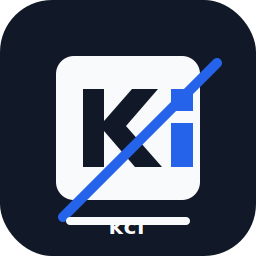

<p align="center">
  
</p>

<h1 align="center">katana-canvas-forge</h1>

<p align="center">
  <code>kcf</code> — versioned diagram rendering and document export runtime for
  <a href="https://github.com/HiroyukiFuruno/KatanA">KatanA</a>.
</p>

<p align="center">
  <strong><a href="#status">Status</a></strong> |
  <strong><a href="#scope">Scope</a></strong> |
  <strong><a href="#layout">Layout</a></strong> |
  <strong><a href="docs/release.md">Release</a></strong>
</p>

<p align="center">
  <a href="LICENSE"></a>
  <a href="https://github.com/HiroyukiFuruno/katana-canvas-forge/actions/workflows/ci.yml"></a>
  <a href="https://github.com/HiroyukiFuruno/katana-canvas-forge/actions/workflows/release-preflight.yml"></a>
  <a href="https://github.com/HiroyukiFuruno/katana-canvas-forge/releases/latest"></a>
  <a href="https://crates.io/crates/katana-canvas-forge"></a>
  
</p>

---

## Status

v0.1.0 release candidate. Mermaid rendering, Draw.io rendering,
HTML / PDF / PNG / JPEG export, and reference score tooling have been
transferred from [KatanA](https://github.com/HiroyukiFuruno/KatanA)
into this repository.

KatanA will consume this crate after the follow-up score improvement patch.
The v0.1.0 release itself does not change KatanA behavior.

## Scope

- Mermaid rendering through a Rust-managed JavaScript runtime, with the
  official `mermaid.min.js` bundle supplied by the local runtime path.
- Draw.io rendering as a sibling backend behind the same renderer interface
  where compatible, otherwise as a separately documented backend.
- HTML / PDF / PNG / JPEG export from rendered output.
- Reference-image generation and ImageMagick scoring against upstream
  Mermaid.js and Draw.io renderers.
- A library API consumed by KatanA and a `kcf` CLI for single-shot render,
  reference update, comparison, and benchmarking.

## Non-Scope

- Markdown parsing, preview UI, editor UI, theme state, or any KatanA UI
  concern. This crate must not depend on `egui`, KatanA preview widgets,
  or KatanA UI state.
- Viewer rendering for CSV / PDF / Office files. These are planned as later
  kcf changes and are separate from v0.1.0 export support.
- LLM chat UI / agent protocols — see
  [`katana-chat-ui`](https://github.com/HiroyukiFuruno/katana-chat-ui).

## Layout

```
crates/
  katana-canvas-forge/         # library
  katana-canvas-forge-cli/     # `kcf` CLI binary
scripts/
  mermaid/                     # official reference generation and scoring
  drawio/                      # official reference generation and scoring
tests/fixtures/
  mermaid/                     # Mermaid input and committed reference images
  drawio/                      # Draw.io input and committed reference images
docs/                          # release and coding notes
```

## License

MIT — see [LICENSE](LICENSE).
