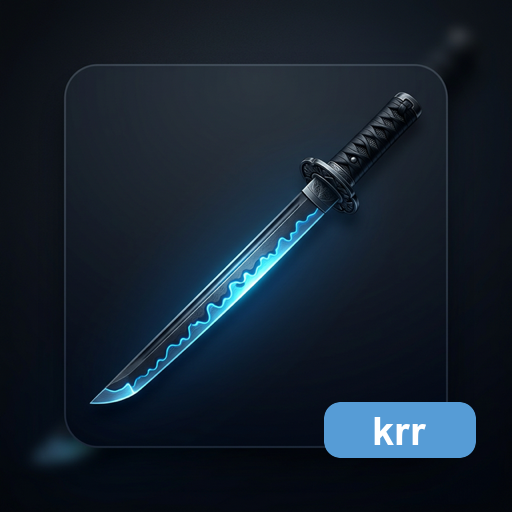

<p align="center">
  
</p>

<h1 align="center">katana-render-runtime</h1>

<p align="center">
  Mermaid、Draw.io、PlantUML、MathJax を SVG へ変換する Rust の描画実行基盤（render runtime）。
</p>

<p align="center">
  <strong><a href="#installation">インストール（Installation）</a></strong> |
  <strong><a href="#library-api">ライブラリ API（Library API）</a></strong> |
  <strong><a href="#migration">移行（Migration）</a></strong> |
  <strong><a href="docs/release.md">リリース（Release）</a></strong>
</p>

<p align="center">
  <a href="LICENSE"></a>
  <a href="https://github.com/HiroyukiFuruno/katana-render-runtime/actions/workflows/test-and-build.yml"></a>
  <a href="https://github.com/HiroyukiFuruno/katana-render-runtime/releases/latest"></a>
  <a href="https://crates.io/crates/katana-render-runtime"></a>
  <a href="https://docs.rs/katana-render-runtime"></a>
  
</p>

---

## KRR とは

`katana-render-runtime` は、KatanA から切り出した描画実行基盤（render runtime）です。

上位アプリケーション（application）は Markdown 抽象構文木（AST）などで入力種別を判定し、この crate へ正規化済み入力文字列（input string）を渡します。KRR は受け取った文字列を SVG に変換します。HTML、PDF、PNG、JPG の生成や Markdown AST 解析は担当しません。

## 機能

- Mermaid / Draw.io / ZenUML / PlantUML の SVG 描画（SVG rendering）。
- MathJax v4 系による TeX 入力（TeX input）から SVG 出力（SVG output）への変換。
- テーマ（theme）/ 暗色モード（dark mode）/ 診断（diagnostics）/ 寸法メタデータ（dimensions metadata）を含む共通 `RenderInput` / `RenderOutput` 契約（contract）。
- 失敗時は panic せず、診断（diagnostics）付き raw 文字列（raw string）を返す代替出力（fallback）。
- `krr` CLI による既存の図形描画 workflow。

## インストール（Installation）

Rust ライブラリ（Rust library）:

```bash
cargo add katana-render-runtime
```

旧 crate 名が必要な既存利用側（consumer）:

```bash
cargo add katana-diagram-renderer
```

CLI:

```bash
cargo install katana-render-runtime-cli
```

## ライブラリ API（Library API）

主要な入口:

- `RenderInput`
- `RenderOutput`
- `RenderKind`
- `MermaidRenderer`
- `DrawioRenderer`
- `PlantUmlRenderer`
- `MathJaxRenderer`

MathJax は TeX 文字列を直接受け取ります。`$...$`、`$$...$$`、fenced `math` の検出は KDV / KMM 側の責務です。

## 移行（Migration）

`katana-diagram-renderer` は v0.3.0 から互換 wrapper です。新規実装の正本は `katana-render-runtime` にあります。

```toml
[dependencies]
katana-render-runtime = "0.3"
```

既存利用側（consumer）は一時的に次の指定でも動きます。

```toml
[dependencies]
katana-diagram-renderer = "0.3"
```

ただし、新規依存（dependency）は `katana-render-runtime` を使ってください。

## 非目標（Non-Goals）

- Markdown AST 解析。
- HTML / PDF / PNG / JPG の export surface 生成。
- preview UI、editor UI、KatanA UI state の所有。
- KDV 側の pagination や document export。

## 構成（Layout）

```text
crates/
  katana-render-runtime/          # 描画実行基盤（render runtime）library
  katana-diagram-renderer/        # 互換 wrapper（compatibility wrapper）
  katana-render-runtime-cli/      # krr CLI binary
scripts/
  mermaid/                        # 公式参照生成と採点（official reference generation and scoring）
  drawio/                         # 公式参照生成と採点（official reference generation and scoring）
  runtime-assets/                 # runtime asset latest / update helpers
tests/fixtures/
  mermaid/
  drawio/
  plantuml/
docs/
```

## License

MIT - see [LICENSE](LICENSE).
