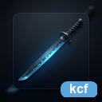

<p align="center">
  
</p>

<h1 align="center">katana-diagram-renderer</h1>

<p align="center">
  A Rust rendering core and <code>kdr</code> CLI for Mermaid, Draw.io, PlantUML,
  math, and other external rendering workflows.
</p>

<p align="center">
  <strong><a href="#installation">Installation</a></strong> |
  <strong><a href="#cli-usage">CLI Usage</a></strong> |
  <strong><a href="#library-api">Library API</a></strong> |
  <strong><a href="#layout">Layout</a></strong> |
  <strong><a href="docs/release.md">Release</a></strong>
</p>

<p align="center">
  <a href="LICENSE"></a>
  <a href="https://github.com/HiroyukiFuruno/katana-diagram-renderer/actions/workflows/ci.yml"></a>
  <a href="https://github.com/HiroyukiFuruno/katana-diagram-renderer/releases/latest"></a>
  <a href="https://crates.io/crates/katana-diagram-renderer"></a>
  <a href="https://docs.rs/katana-diagram-renderer"></a>
  
</p>

---

## What is kdr

`katana-diagram-renderer` provides the portable external rendering layer extracted
from [KatanA](https://github.com/HiroyukiFuruno/KatanA). It keeps diagram
rendering, reference generation, and score comparison in a standalone Rust crate
so downstream applications can integrate the same behavior without
depending on KatanA Desktop internals.

The project is intentionally narrow: its final responsibility is external
diagram rendering and reference-score maintenance.

## Features

- **Mermaid rendering** through the official Mermaid JavaScript runtime.
- **Draw.io rendering** through transferred KatanA-compatible runtime logic.
- **ZenUML rendering** through the Mermaid-compatible ZenUML runtime.
- **Reference snapshots** for committed Mermaid and Draw.io fixtures.
- **Image scoring** against official renderer output for regression tracking.
- **`kdr` CLI** for render, reference update, comparison, and benchmark workflows.

## Installation

Use the library from Rust:

```bash
cargo add katana-diagram-renderer
```

Install the CLI:

```bash
cargo install katana-diagram-renderer-cli
```

The installed binary is `kdr`.

## CLI Usage

Render diagrams:

```bash
kdr mermaid render --input input.md --output output.svg
kdr drawio render --input diagram.drawio --output output.svg
```

Run reference workflows:

```bash
kdr mermaid reference-update --fixtures tests/fixtures/mermaid
kdr mermaid compare --fixtures tests/fixtures/mermaid --min-score 99
kdr drawio bench --fixtures tests/fixtures/drawio
```

## Library API

Embed `katana-diagram-renderer` when an application needs external diagram or math
rendering in-process.

Primary integration points:

- `RenderInput`
- `RenderOutput`
- `DiagramKind`
- Mermaid renderer
- Draw.io renderer

The API keeps KatanA integration needs in mind, but the crate remains standalone.
Consumers should treat KatanA UI state, editor state, and workspace navigation as
their own responsibilities.

## Non-Goals

- Markdown parsing, preview UI, editor UI, theme state, or any KatanA UI
  concern. This crate must not depend on `egui`, KatanA preview widgets,
  or KatanA UI state.
- Markdown viewer or document export ownership. HTML/PDF/PNG/JPG output belongs
  outside this crate.
- Viewer rendering for CSV / PDF / Office files. These are KDV responsibilities,
  not new KDR scope.
- LLM chat UI / agent protocols. See
  [`katana-chat-ui`](https://github.com/HiroyukiFuruno/katana-chat-ui).

## Layout

```
crates/
  katana-diagram-renderer/         # library
  katana-diagram-renderer-cli/     # `kdr` CLI binary
scripts/
  mermaid/                     # official reference generation and scoring
  drawio/                      # official reference generation and scoring
tests/fixtures/
  mermaid/                     # Mermaid input and committed reference images
  drawio/                      # Draw.io input and committed reference images
docs/                          # release and coding notes
```

## License

MIT — see [LICENSE](LICENSE).
