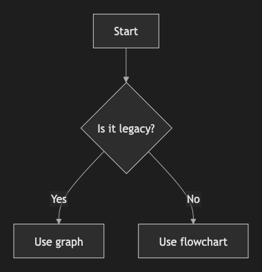

# 2. Graph

~~~mermaid
graph TD
    A[Start] --> B{Is it legacy?}
    B -- Yes --> C[Use graph]
    B -- No --> D[Use flowchart]
~~~

<!-- katana-mermaid-official:start -->

## 公式Mermaid.js描画

<!-- katana-mermaid-official:end -->
