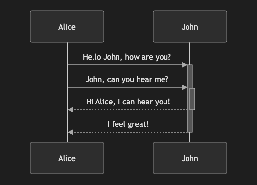

# 4.2. Sequence Diagram (Activate/Deactivate)

~~~mermaid
sequenceDiagram
    Alice->>+John: Hello John, how are you?
    Alice->>+John: John, can you hear me?
    John-->>-Alice: Hi Alice, I can hear you!
    John-->>-Alice: I feel great!
~~~

<!-- katana-mermaid-official:start -->

## 公式Mermaid.js描画

<!-- katana-mermaid-official:end -->
