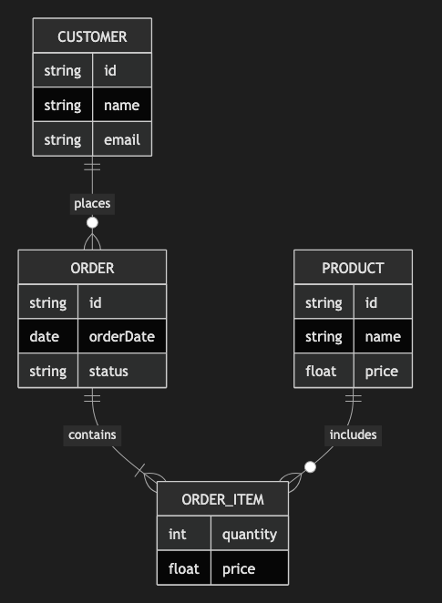

# 5.2. ER Diagram (Multi-entity)

~~~mermaid
erDiagram
    CUSTOMER ||--o{ ORDER : places
    ORDER ||--|{ ORDER_ITEM : contains
    PRODUCT ||--o{ ORDER_ITEM : includes
    CUSTOMER {
        string id
        string name
        string email
    }
    ORDER {
        string id
        date orderDate
        string status
    }
    PRODUCT {
        string id
        string name
        float price
    }
    ORDER_ITEM {
        int quantity
        float price
    }
~~~

<!-- katana-mermaid-official:start -->

## 公式Mermaid.js描画

<!-- katana-mermaid-official:end -->
