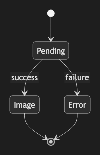

# 6.1. State Diagram v2 (Failure path)

~~~mermaid
stateDiagram-v2
    [*] --> Pending
    Pending --> Image : success
    Pending --> Error : failure
    Image --> [*]
    Error --> [*]
~~~

<!-- katana-mermaid-official:start -->

## 公式Mermaid.js描画

<!-- katana-mermaid-official:end -->
