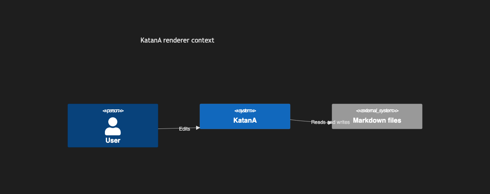

# 8.1. C4 Context (Simple)

~~~mermaid
C4Context
    title KatanA renderer context
    Person(user, "User")
    System(katana, "KatanA")
    System_Ext(files, "Markdown files")
    Rel(user, katana, "Edits")
    Rel(katana, files, "Reads and writes")
~~~

<!-- katana-mermaid-official:start -->

## 公式Mermaid.js描画

<!-- katana-mermaid-official:end -->
