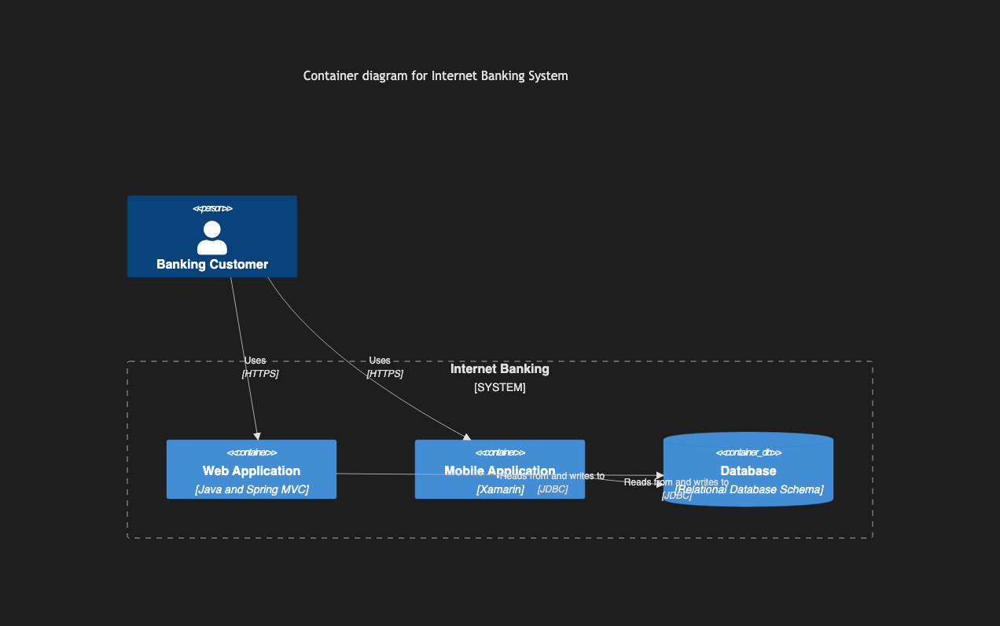

# 8.3. C4 Container

~~~mermaid
C4Container
    title Container diagram for Internet Banking System
    Person(customer, "Banking Customer")
    System_Boundary(c1, "Internet Banking") {
        Container(web_app, "Web Application", "Java and Spring MVC")
        Container(mobile_app, "Mobile Application", "Xamarin")
        ContainerDb(database, "Database", "Relational Database Schema")
    }
    Rel(customer, web_app, "Uses", "HTTPS")
    Rel(customer, mobile_app, "Uses", "HTTPS")
    Rel(web_app, database, "Reads from and writes to", "JDBC")
    Rel(mobile_app, database, "Reads from and writes to", "JDBC")
~~~

<!-- katana-mermaid-official:start -->

## 公式Mermaid.js描画

<!-- katana-mermaid-official:end -->
