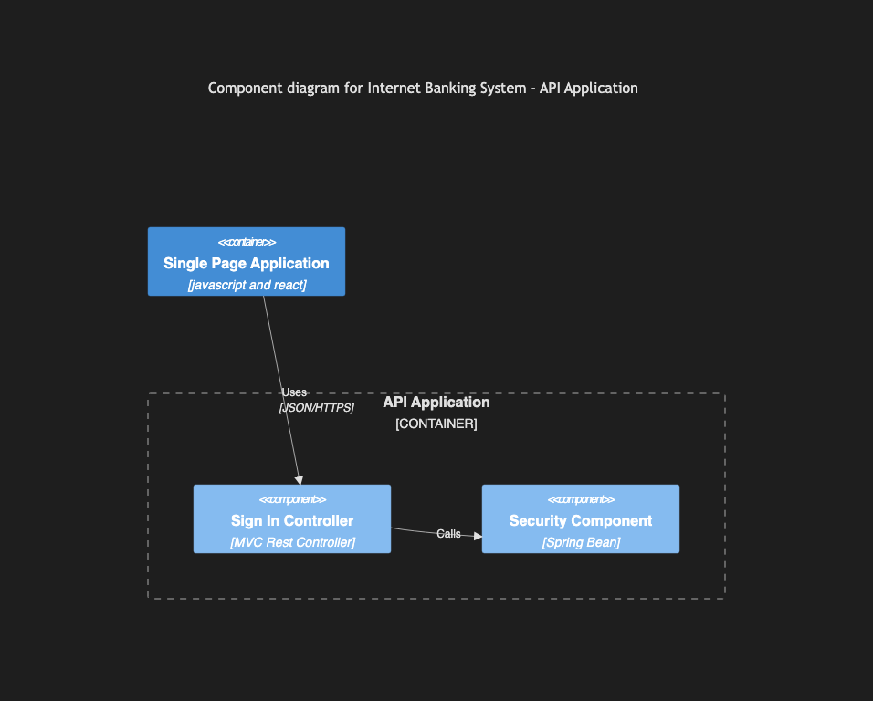

# 8.4. C4 Component

~~~mermaid
C4Component
    title Component diagram for Internet Banking System - API Application
    Container(spa, "Single Page Application", "javascript and react")
    Container_Boundary(api, "API Application") {
        Component(sign_in, "Sign In Controller", "MVC Rest Controller")
        Component(security, "Security Component", "Spring Bean")
    }
    Rel(spa, sign_in, "Uses", "JSON/HTTPS")
    Rel(sign_in, security, "Calls")
~~~

<!-- katana-mermaid-official:start -->

## 公式Mermaid.js描画

<!-- katana-mermaid-official:end -->
