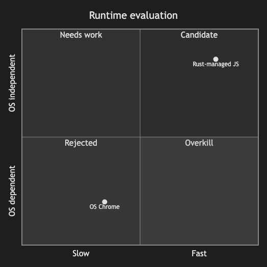

# 17.1. Quadrant Chart (Simple)

~~~mermaid
quadrantChart
    title Runtime evaluation
    x-axis Slow --> Fast
    y-axis OS dependent --> OS independent
    quadrant-1 Candidate
    quadrant-2 Needs work
    quadrant-3 Rejected
    quadrant-4 Overkill
    Rust-managed JS: [0.82, 0.86]
    OS Chrome: [0.35, 0.20]
~~~

<!-- katana-mermaid-official:start -->

## 公式Mermaid.js描画

<!-- katana-mermaid-official:end -->
