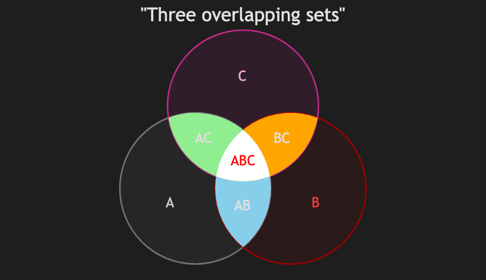

# 25.2. Venn Diagram (3 sets with styles)

~~~mermaid
venn-beta
    title "Three overlapping sets"
    set A
    set B
    set C
    union A,B["AB"]
    union B,C["BC"]
    union A,C["AC"]
    union A,B,C["ABC"]
    style A,B fill:skyblue
    style B,C fill:orange
    style A,C fill:lightgreen
    style A,B,C fill:white, color:red
~~~

<!-- katana-mermaid-official:start -->

## 公式Mermaid.js描画

<!-- katana-mermaid-official:end -->
