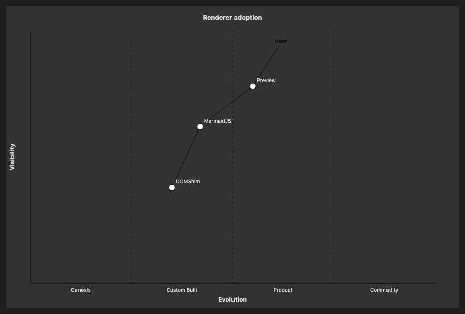

# 26.1. Wardley Map (Simple)

~~~mermaid
wardley-beta
    title Renderer adoption
    anchor User [0.95, 0.62]
    component Preview [0.78, 0.55]
    component MermaidJS [0.62, 0.42]
    component DOMShim [0.38, 0.35]
    User->Preview
    Preview->MermaidJS
    MermaidJS->DOMShim
~~~

<!-- katana-mermaid-official:start -->

## 公式Mermaid.js描画

<!-- katana-mermaid-official:end -->
