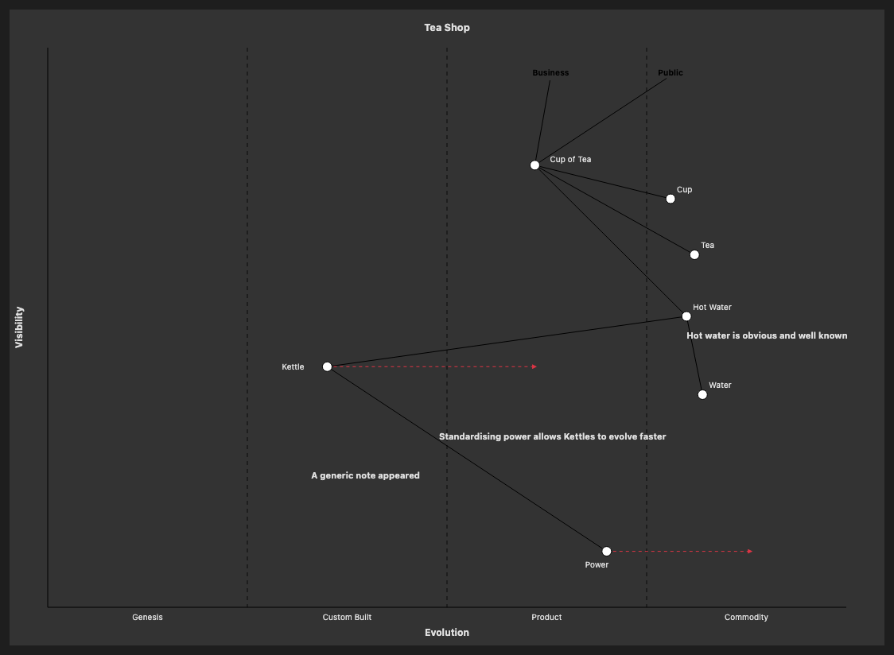

# 26.2. Wardley Map (Full with notes)

~~~mermaid
wardley-beta
title Tea Shop
size [1100, 800]

anchor Business [0.95, 0.63]
anchor Public [0.95, 0.78]
component Cup of Tea [0.79, 0.61] label [19, -4]
component Cup [0.73, 0.78]
component Tea [0.63, 0.81]
component Hot Water [0.52, 0.80]
component Water [0.38, 0.82]
component Kettle [0.43, 0.35] label [-57, 4]
component Power [0.1, 0.7] label [-27, 20]

Business -> Cup of Tea
Public -> Cup of Tea
Cup of Tea -> Cup
Cup of Tea -> Tea
Cup of Tea -> Hot Water
Hot Water -> Water
Hot Water -> Kettle
Kettle -> Power

evolve Kettle 0.62
evolve Power 0.89

note "Standardising power allows Kettles to evolve faster" [0.30, 0.49]
note "Hot water is obvious and well known" [0.48, 0.80]
note "A generic note appeared" [0.23, 0.33]
~~~

<!-- katana-mermaid-official:start -->

## 公式Mermaid.js描画

<!-- katana-mermaid-official:end -->
