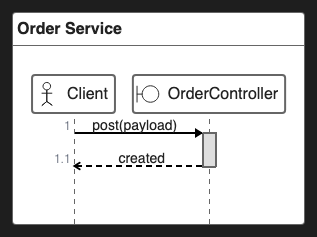

# 29. ZenUML Direct Fence

~~~zenuml
title Order Service
@Actor Client
@Boundary OrderController

@Starter(Client)
OrderController.post(payload) {
  return "created"
}
~~~

<!-- katana-mermaid-official:start -->

## 公式Mermaid.js描画

<!-- katana-mermaid-official:end -->
