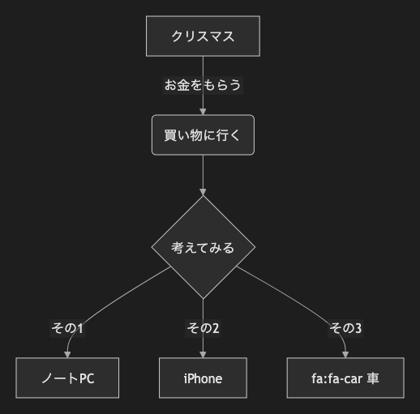

# 1. フローチャート

~~~mermaid
flowchart TD
    A[クリスマス] -->|お金をもらう| B(買い物に行く)
    B --> C{考えてみる}
    C -->|その1| D[ノートPC]
    C -->|その2| E[iPhone]
    C -->|その3| F[fa:fa-car 車]
~~~

<!-- katana-mermaid-official:start -->

## 公式Mermaid.js描画

<!-- katana-mermaid-official:end -->
