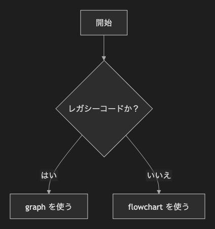

# 2. グラフ

~~~mermaid
graph TD
    A[開始] --> B{レガシーコードか？}
    B -- はい --> C[graph を使う]
    B -- いいえ --> D[flowchart を使う]
~~~

<!-- katana-mermaid-official:start -->

## 公式Mermaid.js描画

<!-- katana-mermaid-official:end -->
