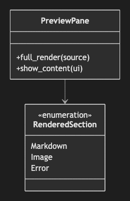

# 3.1. クラス図（列挙型）

~~~mermaid
classDiagram
    class PreviewPane {
        +full_render(source)
        +show_content(ui)
    }
    class RenderedSection {
        <<enumeration>>
        Markdown
        Image
        Error
    }
    PreviewPane --> RenderedSection
~~~

<!-- katana-mermaid-official:start -->

## 公式Mermaid.js描画

<!-- katana-mermaid-official:end -->
