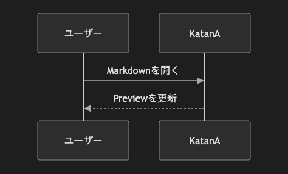

# 4.1. シーケンス図（シンプル）

~~~mermaid
sequenceDiagram
    participant User as ユーザー
    participant App as KatanA
    User->>App: Markdownを開く
    App-->>User: Previewを更新
~~~

<!-- katana-mermaid-official:start -->

## 公式Mermaid.js描画

<!-- katana-mermaid-official:end -->
