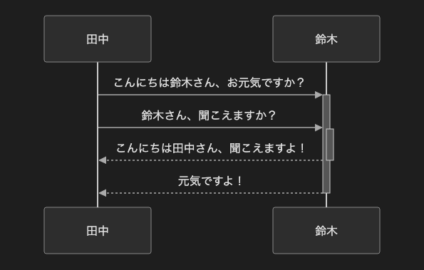

# 4.2. シーケンス図（アクティベーション）

~~~mermaid
sequenceDiagram
    田中->>+鈴木: こんにちは鈴木さん、お元気ですか？
    田中->>+鈴木: 鈴木さん、聞こえますか？
    鈴木-->>-田中: こんにちは田中さん、聞こえますよ！
    鈴木-->>-田中: 元気ですよ！
~~~

<!-- katana-mermaid-official:start -->

## 公式Mermaid.js描画

<!-- katana-mermaid-official:end -->
