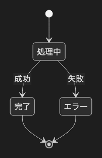

# 6.1. 状態遷移図 v2（失敗パス）

~~~mermaid
stateDiagram-v2
    [*] --> 処理中
    処理中 --> 完了 : 成功
    処理中 --> エラー : 失敗
    完了 --> [*]
    エラー --> [*]
~~~

<!-- katana-mermaid-official:start -->

## 公式Mermaid.js描画

<!-- katana-mermaid-official:end -->
