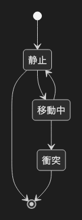

# 6.2. 状態遷移図 v2

~~~mermaid
stateDiagram-v2
    [*] --> 静止
    静止 --> [*]
    静止 --> 移動中
    移動中 --> 静止
    移動中 --> 衝突
    衝突 --> [*]
~~~

<!-- katana-mermaid-official:start -->

## 公式Mermaid.js描画

<!-- katana-mermaid-official:end -->
