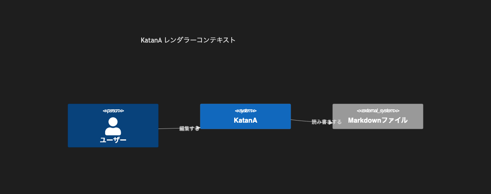

# 8.1. C4 コンテキスト（シンプル）

~~~mermaid
C4Context
    title KatanA レンダラーコンテキスト
    Person(user, "ユーザー")
    System(katana, "KatanA")
    System_Ext(files, "Markdownファイル")
    Rel(user, katana, "編集する")
    Rel(katana, files, "読み書きする")
~~~

<!-- katana-mermaid-official:start -->

## 公式Mermaid.js描画

<!-- katana-mermaid-official:end -->
