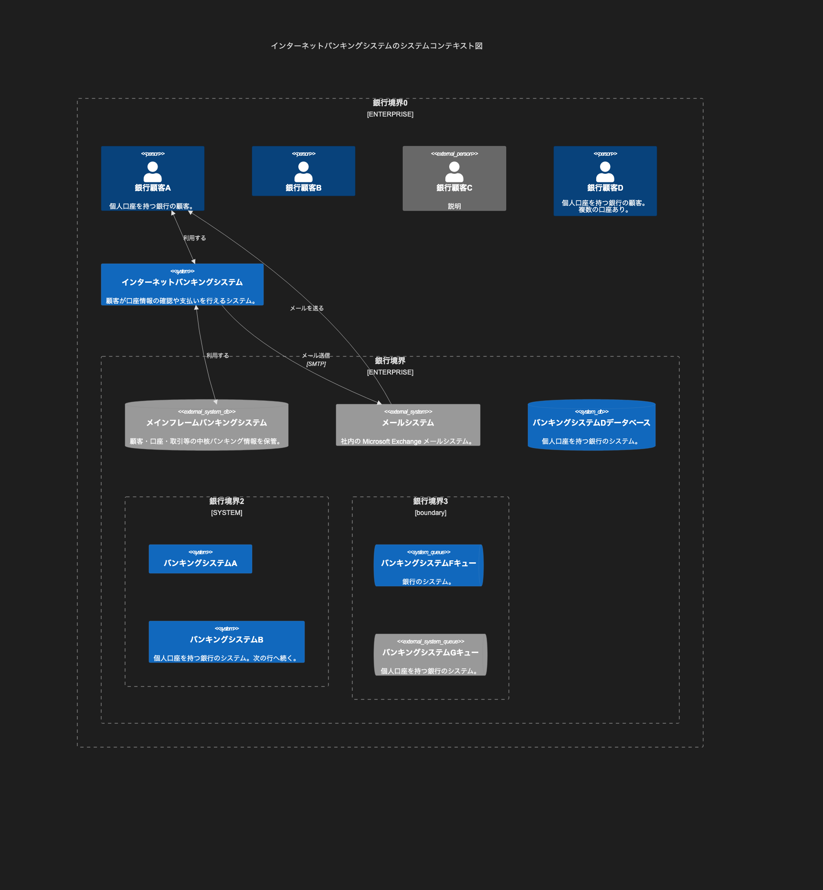

# 8.2. C4 コンテキスト（フル）

~~~mermaid
C4Context
    title インターネットバンキングシステムのシステムコンテキスト図
    Enterprise_Boundary(b0, "銀行境界0") {
        Person(customerA, "銀行顧客A", "個人口座を持つ銀行の顧客。")
        Person(customerB, "銀行顧客B")
        Person_Ext(customerC, "銀行顧客C", "説明")

        Person(customerD, "銀行顧客D", "個人口座を持つ銀行の顧客。  複数の口座あり。")

        System(SystemAA, "インターネットバンキングシステム", "顧客が口座情報の確認や支払いを行えるシステム。")

        Enterprise_Boundary(b1, "銀行境界") {
            SystemDb_Ext(SystemE, "メインフレームバンキングシステム", "顧客・口座・取引等の中核バンキング情報を保管。")

            System_Boundary(b2, "銀行境界2") {
                System(SystemA, "バンキングシステムA")
                System(SystemB, "バンキングシステムB", "個人口座を持つ銀行のシステム。次の行へ続く。")
            }

            System_Ext(SystemC, "メールシステム", "社内の Microsoft Exchange メールシステム。")
            SystemDb(SystemD, "バンキングシステムDデータベース", "個人口座を持つ銀行のシステム。")

            Boundary(b3, "銀行境界3", "boundary") {
                SystemQueue(SystemF, "バンキングシステムFキュー", "銀行のシステム。")
                SystemQueue_Ext(SystemG, "バンキングシステムGキュー", "個人口座を持つ銀行のシステム。")
            }
        }
    }

    BiRel(customerA, SystemAA, "利用する")
    BiRel(SystemAA, SystemE, "利用する")
    Rel(SystemAA, SystemC, "メール送信", "SMTP")
    Rel(SystemC, customerA, "メールを送る")
~~~

<!-- katana-mermaid-official:start -->

## 公式Mermaid.js描画

<!-- katana-mermaid-official:end -->
