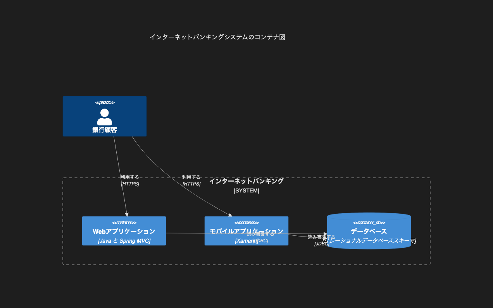

# 8.3. C4 コンテナ

~~~mermaid
C4Container
    title インターネットバンキングシステムのコンテナ図
    Person(customer, "銀行顧客")
    System_Boundary(c1, "インターネットバンキング") {
        Container(web_app, "Webアプリケーション", "Java と Spring MVC")
        Container(mobile_app, "モバイルアプリケーション", "Xamarin")
        ContainerDb(database, "データベース", "リレーショナルデータベーススキーマ")
    }
    Rel(customer, web_app, "利用する", "HTTPS")
    Rel(customer, mobile_app, "利用する", "HTTPS")
    Rel(web_app, database, "読み書きする", "JDBC")
    Rel(mobile_app, database, "読み書きする", "JDBC")
~~~

<!-- katana-mermaid-official:start -->

## 公式Mermaid.js描画

<!-- katana-mermaid-official:end -->
