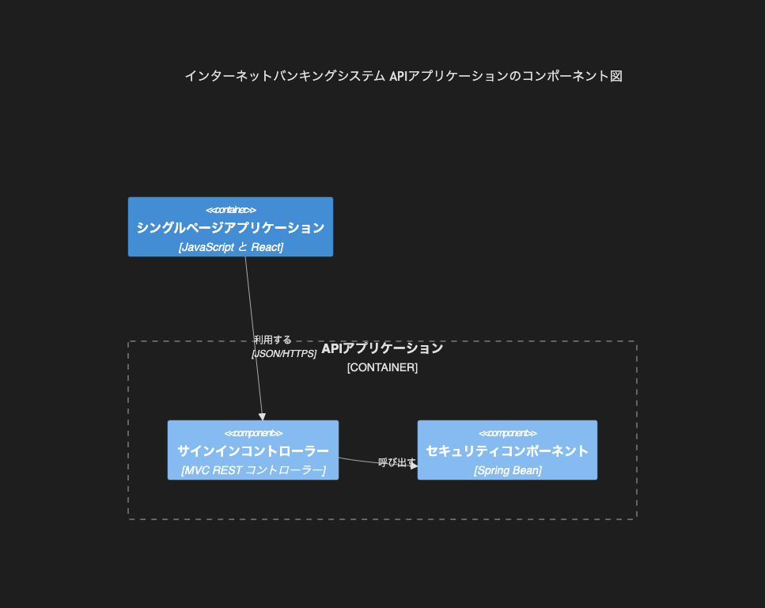

# 8.4. C4 コンポーネント

~~~mermaid
C4Component
    title インターネットバンキングシステム APIアプリケーションのコンポーネント図
    Container(spa, "シングルページアプリケーション", "JavaScript と React")
    Container_Boundary(api, "APIアプリケーション") {
        Component(sign_in, "サインインコントローラー", "MVC REST コントローラー")
        Component(security, "セキュリティコンポーネント", "Spring Bean")
    }
    Rel(spa, sign_in, "利用する", "JSON/HTTPS")
    Rel(sign_in, security, "呼び出す")
~~~

<!-- katana-mermaid-official:start -->

## 公式Mermaid.js描画

<!-- katana-mermaid-official:end -->
