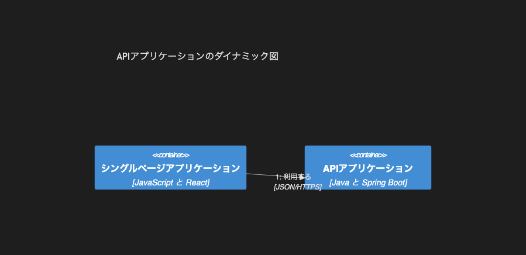

# 8.5. C4 ダイナミック

~~~mermaid
C4Dynamic
    title APIアプリケーションのダイナミック図
    Container(spa, "シングルページアプリケーション", "JavaScript と React")
    Container(api, "APIアプリケーション", "Java と Spring Boot")
    Rel(spa, api, "利用する", "JSON/HTTPS")
~~~

<!-- katana-mermaid-official:start -->

## 公式Mermaid.js描画

<!-- katana-mermaid-official:end -->
