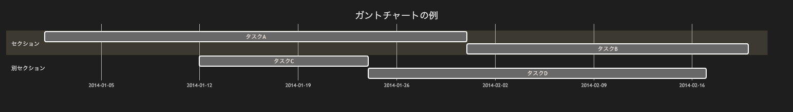

# 11.2. ガントチャート（複数セクション）

~~~mermaid
gantt
    title ガントチャートの例
    dateFormat  YYYY-MM-DD
    section セクション
    タスクA           :a1, 2014-01-01, 30d
    タスクB           :after a1  , 20d
    section 別セクション
    タスクC           :2014-01-12  , 12d
    タスクD           : 24d
~~~

<!-- katana-mermaid-official:start -->

## 公式Mermaid.js描画

<!-- katana-mermaid-official:end -->
