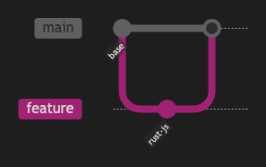

# 12.1. Gitグラフ（シンプル）

~~~mermaid
gitGraph
    commit id: "base"
    branch feature
    checkout feature
    commit id: "rust-js"
    checkout main
    merge feature
~~~

<!-- katana-mermaid-official:start -->

## 公式Mermaid.js描画

<!-- katana-mermaid-official:end -->
