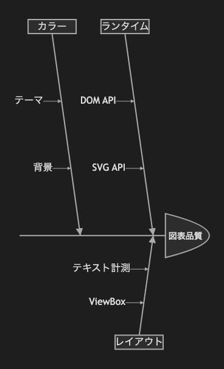

# 13.1. 特性要因図（3カテゴリ）

~~~mermaid
ishikawa-beta
  図表品質
    ランタイム
      DOM API
      SVG API
    レイアウト
      テキスト計測
      ViewBox
    カラー
      テーマ
      背景
~~~

<!-- katana-mermaid-official:start -->

## 公式Mermaid.js描画

<!-- katana-mermaid-official:end -->
