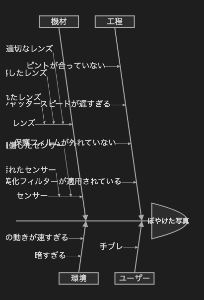

# 13.2. 特性要因図（4カテゴリ）

~~~mermaid
ishikawa-beta
    ぼやけた写真
    工程
        ピントが合っていない
        シャッタースピードが遅すぎる
        保護フィルムが外れていない
        美化フィルターが適用されている
    ユーザー
        手ブレ
    機材
        レンズ
            不適切なレンズ
            損傷したレンズ
            汚れたレンズ
        センサー
            損傷したセンサー
            汚れたセンサー
    環境
        被写体の動きが速すぎる
        暗すぎる
~~~

<!-- katana-mermaid-official:start -->

## 公式Mermaid.js描画

<!-- katana-mermaid-official:end -->
