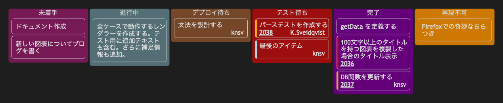

# 14.2. カンバン（フル）

~~~mermaid
---
config:
  kanban:
    ticketBaseUrl: 'https://github.com/mermaid-js/mermaid/issues/#TICKET#'
---
kanban
  未着手
    [ドキュメント作成]
    docs[新しい図表についてブログを書く]
  [進行中]
    id6[全ケースで動作するレンダラーを作成する。テスト用に追加テキストも含む。さらに補足情報も追加。]
  id9[デプロイ待ち]
    id8[文法を設計する]@{ assigned: 'knsv' }
  id10[テスト待ち]
    id4[パーステストを作成する]@{ ticket: 2038, assigned: 'K.Sveidqvist', priority: 'High' }
    id66[最後のアイテム]@{ priority: 'Very Low', assigned: 'knsv' }
  id11[完了]
    id5[getData を定義する]
    id2[100文字以上のタイトルを持つ図表を複製した場合のタイトル表示]@{ ticket: 2036, priority: 'Very High'}
    id3[DB関数を更新する]@{ ticket: 2037, assigned: knsv, priority: 'High' }

  id12[再現不可]
    id3[Firefoxでの奇妙なちらつき]
~~~

<!-- katana-mermaid-official:start -->

## 公式Mermaid.js描画

<!-- katana-mermaid-official:end -->
