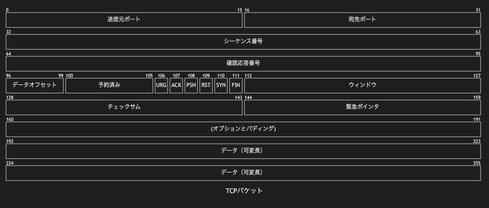

# 15.2. パケット（TCP フル）

~~~mermaid
---
title: "TCPパケット"
---
packet
0-15: "送信元ポート"
16-31: "宛先ポート"
32-63: "シーケンス番号"
64-95: "確認応答番号"
96-99: "データオフセット"
100-105: "予約済み"
106: "URG"
107: "ACK"
108: "PSH"
109: "RST"
110: "SYN"
111: "FIN"
112-127: "ウィンドウ"
128-143: "チェックサム"
144-159: "緊急ポインタ"
160-191: "(オプションとパディング)"
192-255: "データ（可変長）"
~~~

<!-- katana-mermaid-official:start -->

## 公式Mermaid.js描画

<!-- katana-mermaid-official:end -->
