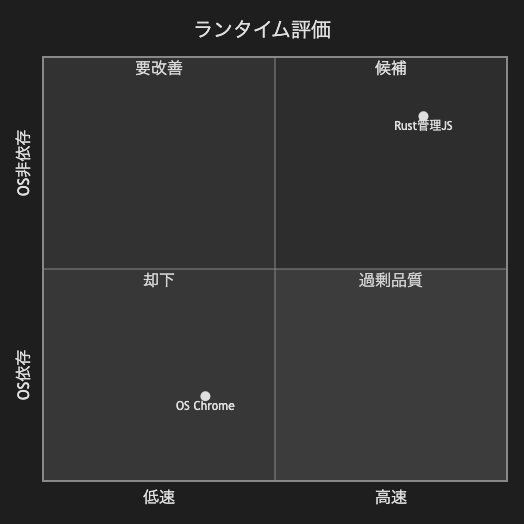

# 17.1. 象限チャート（シンプル）

~~~mermaid
quadrantChart
    title ランタイム評価
    x-axis 低速 --> 高速
    y-axis OS依存 --> OS非依存
    quadrant-1 候補
    quadrant-2 要改善
    quadrant-3 却下
    quadrant-4 過剰品質
    Rust管理JS: [0.82, 0.86]
    OS Chrome: [0.35, 0.20]
~~~

<!-- katana-mermaid-official:start -->

## 公式Mermaid.js描画

<!-- katana-mermaid-official:end -->
