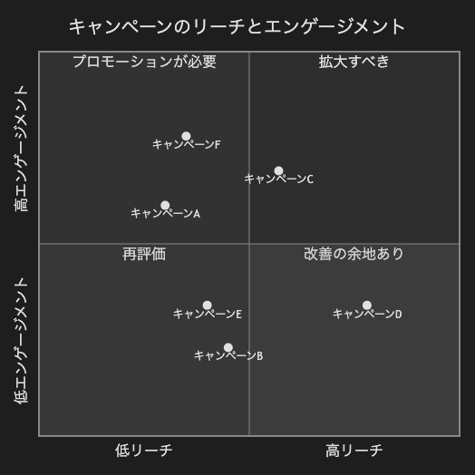

# 17.2. 象限チャート（キャンペーン）

~~~mermaid
quadrantChart
    title キャンペーンのリーチとエンゲージメント
    x-axis 低リーチ --> 高リーチ
    y-axis 低エンゲージメント --> 高エンゲージメント
    quadrant-1 拡大すべき
    quadrant-2 プロモーションが必要
    quadrant-3 再評価
    quadrant-4 改善の余地あり
    キャンペーンA: [0.3, 0.6]
    キャンペーンB: [0.45, 0.23]
    キャンペーンC: [0.57, 0.69]
    キャンペーンD: [0.78, 0.34]
    キャンペーンE: [0.40, 0.34]
    キャンペーンF: [0.35, 0.78]
~~~

<!-- katana-mermaid-official:start -->

## 公式Mermaid.js描画

<!-- katana-mermaid-official:end -->
