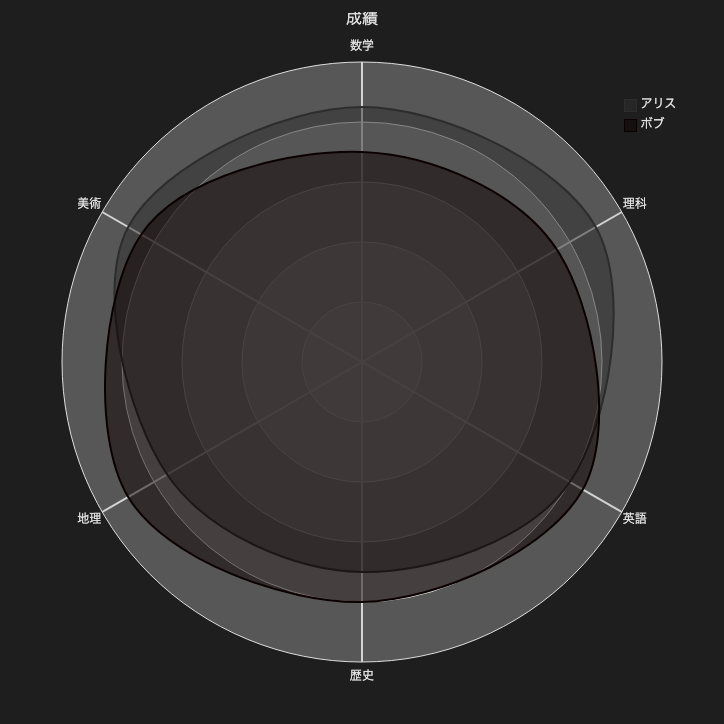

# 18.2. レーダーチャート（6軸）

~~~mermaid
---
title: "成績"
---
radar-beta
  axis m["数学"], s["理科"], e["英語"]
  axis h["歴史"], g["地理"], a["美術"]
  curve a["アリス"]{85, 90, 80, 70, 75, 90}
  curve b["ボブ"]{70, 75, 85, 80, 90, 85}

  max 100
  min 0
~~~

<!-- katana-mermaid-official:start -->

## 公式Mermaid.js描画

<!-- katana-mermaid-official:end -->
