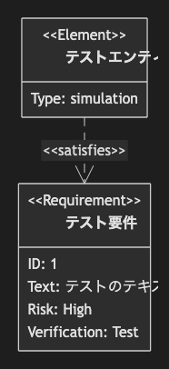

# 19.1. 要件図（単一）

~~~mermaid
requirementDiagram

    requirement テスト要件 {
    id: 1
    text: テストのテキスト。
    risk: high
    verifymethod: test
    }

    element テストエンティティ {
    type: simulation
    }

    テストエンティティ - satisfies -> テスト要件
~~~

<!-- katana-mermaid-official:start -->

## 公式Mermaid.js描画

<!-- katana-mermaid-official:end -->
