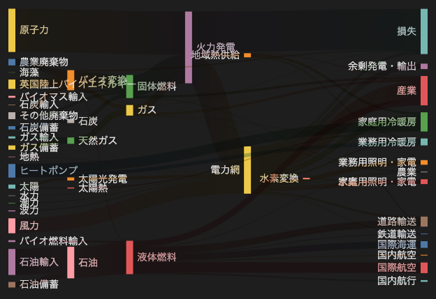

# 20.2. サンキー図（大規模）

~~~mermaid
---
config:
  sankey:
    showValues: false
---
sankey-beta

農業廃棄物,バイオ変換,124.729
バイオ変換,液体燃料,0.597
バイオ変換,損失,26.862
バイオ変換,固体燃料,280.322
バイオ変換,ガス,81.144
バイオ燃料輸入,液体燃料,35
バイオマス輸入,固体燃料,35
石炭輸入,石炭,11.606
石炭備蓄,石炭,63.965
石炭,固体燃料,75.571
地域熱供給,産業,10.639
地域熱供給,業務用冷暖房,22.505
地域熱供給,家庭用冷暖房,46.184
電力網,余剰発電・輸出,104.453
電力網,家庭用冷暖房,113.726
電力網,水素変換,27.14
電力網,産業,342.165
電力網,道路輸送,37.797
電力網,農業,4.412
電力網,業務用冷暖房,40.858
電力網,損失,56.691
電力網,鉄道輸送,7.863
電力網,業務用照明・家電,90.008
電力網,家庭用照明・家電,93.494
ガス輸入,天然ガス,40.719
ガス備蓄,天然ガス,82.233
ガス,業務用冷暖房,0.129
ガス,損失,1.401
ガス,火力発電,151.891
ガス,農業,2.096
ガス,産業,48.58
地熱,電力網,7.013
水素変換,水素,20.897
水素変換,損失,6.242
水素,道路輸送,20.897
水力,電力網,6.995
液体燃料,産業,121.066
液体燃料,国際海運,128.69
液体燃料,道路輸送,135.835
液体燃料,国内航空,14.458
液体燃料,国際航空,206.267
液体燃料,農業,3.64
液体燃料,国内航行,33.218
液体燃料,鉄道輸送,4.413
海藻,バイオ変換,4.375
天然ガス,ガス,122.952
原子力,火力発電,839.978
石油輸入,石油,504.287
石油備蓄,石油,107.703
石油,液体燃料,611.99
その他廃棄物,固体燃料,56.587
その他廃棄物,バイオ変換,77.81
ヒートポンプ,家庭用冷暖房,193.026
ヒートポンプ,業務用冷暖房,70.672
太陽光発電,電力網,59.901
太陽熱,家庭用冷暖房,19.263
太陽,太陽熱,19.263
太陽,太陽光発電,59.901
固体燃料,農業,0.882
固体燃料,火力発電,400.12
固体燃料,産業,46.477
火力発電,電力網,525.531
火力発電,損失,787.129
火力発電,地域熱供給,79.329
潮力,電力網,9.452
英国陸上バイオエネルギー,バイオ変換,182.01
波力,電力網,19.013
風力,電力網,289.366
~~~

<!-- katana-mermaid-official:start -->

## 公式Mermaid.js描画

<!-- katana-mermaid-official:end -->
