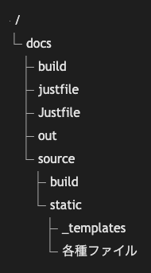

# 22.2. ツリービュー（ファイルシステム）

~~~mermaid
treeView-beta
            "docs"
                "build"
                "justfile"
                "Justfile"
                "out"
                "source"
                    "build"
                    "static"
                        "_templates"
                        "各種ファイル"
~~~

<!-- katana-mermaid-official:start -->

## 公式Mermaid.js描画

<!-- katana-mermaid-official:end -->
