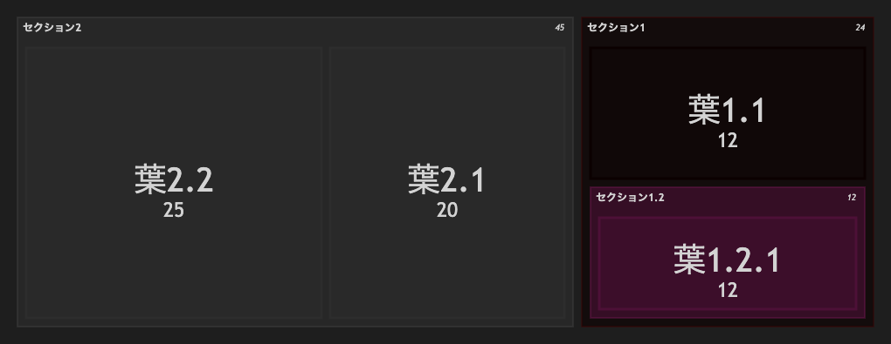

# 23.2. ツリーマップ Beta（ネスト）

~~~mermaid
treemap-beta
"セクション1"
    "葉1.1": 12
    "セクション1.2"
      "葉1.2.1": 12
"セクション2"
    "葉2.1": 20
    "葉2.2": 25
~~~

<!-- katana-mermaid-official:start -->

## 公式Mermaid.js描画

<!-- katana-mermaid-official:end -->
