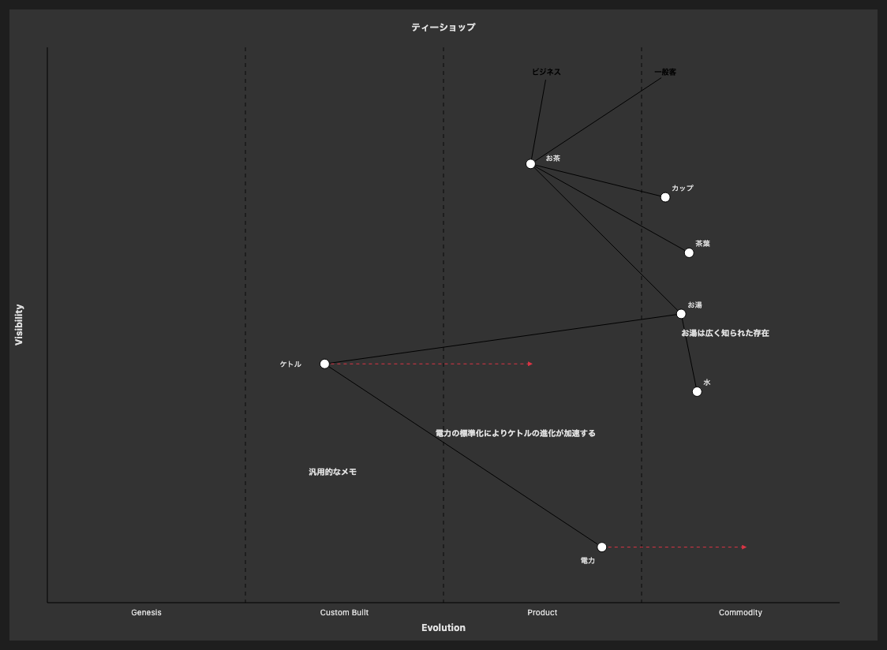

# 26.2. ウォードレーマップ（ノート付き）

~~~mermaid
wardley-beta
title ティーショップ
size [1100, 800]

anchor ビジネス [0.95, 0.63]
anchor 一般客 [0.95, 0.78]
component お茶 [0.79, 0.61] label [19, -4]
component カップ [0.73, 0.78]
component 茶葉 [0.63, 0.81]
component お湯 [0.52, 0.80]
component 水 [0.38, 0.82]
component ケトル [0.43, 0.35] label [-57, 4]
component 電力 [0.1, 0.7] label [-27, 20]

ビジネス -> お茶
一般客 -> お茶
お茶 -> カップ
お茶 -> 茶葉
お茶 -> お湯
お湯 -> 水
お湯 -> ケトル
ケトル -> 電力

evolve ケトル 0.62
evolve 電力 0.89

note "電力の標準化によりケトルの進化が加速する" [0.30, 0.49]
note "お湯は広く知られた存在" [0.48, 0.80]
note "汎用的なメモ" [0.23, 0.33]
~~~

<!-- katana-mermaid-official:start -->

## 公式Mermaid.js描画

<!-- katana-mermaid-official:end -->
